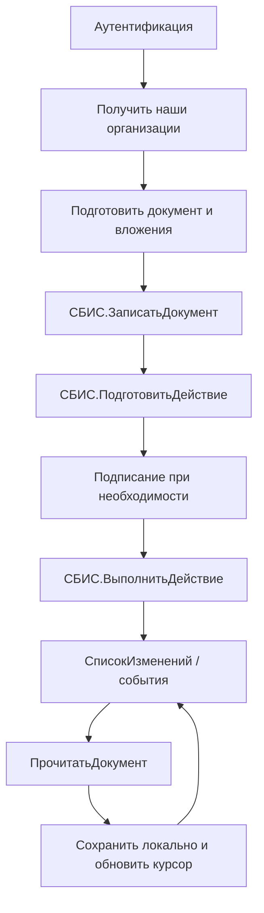

# Saby API — рабочий справочник интегратора

> Практический конспект по официальной документации Saby.  
> Актуальность проверки: **4 августа 2026 года**.  
> Основная документация: <https://saby.ru/help/integration/api>

## Назначение

Этот файл предназначен для ежедневной работы разработчика и аналитика интеграции:

- быстро выбрать способ авторизации;
- отправить первый запрос;
- использовать единый JSON-RPC-клиент;
- получать организации и документы;
- читать, создавать и обрабатывать документы;
- реализовать пагинацию, повторные запросы и журналирование;
- быстро перейти к официальной схеме нужного API-метода.

> [!IMPORTANT]
> В Saby есть несколько прикладных API с разными схемами и способами авторизации. Перед реализацией конкретного сценария откройте раздел нужного сервиса и проверьте его требования. Не смешивайте `X-SBISAccessToken` и `X-SBISSessionID` в одном запросе без прямого указания официальной документации.

---

## 1. Быстрый выбор способа авторизации

| Сценарий | Механизм | Заголовок рабочих запросов | Где получать данные |
|---|---|---|---|
| Фоновая интеграция зарегистрированного внешнего приложения | Сервисная OAuth-авторизация | `X-SBISAccessToken: <token>` | Настройки → Система → Безопасность → Подключения к Saby |
| Пользователь входит через браузер | Интерактивная OAuth 2.0 | `X-SBISAccessToken: <access_token>` | `client_id`, `client_secret`, `redirect_uri` |
| Классический API ЭДО по логину и паролю | JSON-RPC-аутентификация | `X-SBISSessionID: <session_id>` | Логин, пароль, при необходимости номер аккаунта |
| API конкретного сервиса | По документации сервиса | Зависит от сервиса | Раздел API соответствующего продукта |

### Главное различие

- **Access token** относится к авторизации внешнего приложения.
- **Session ID** относится к сессии пользователя классического JSON-RPC API ЭДО.
- Заголовок авторизации выбирается один раз на уровне клиента и используется во всех последующих вызовах этого клиента.

---

## 2. Базовые адреса

```text
Сервисная OAuth-авторизация:
https://online.sbis.ru/oauth/service/

Интерактивная OAuth-авторизация:
https://online.sbis.ru/oauth/api/token

JSON-RPC-аутентификация по логину и паролю:
https://online.sbis.ru/auth/service/

Основной JSON-RPC endpoint:
https://online.sbis.ru/service/?srv=1
```

### Базовые заголовки JSON-RPC

```http
Content-Type: application/json-rpc;charset=utf-8
User-Agent: company-product/1.0
X-SBISSessionID: <session_id>
```

или для access token:

```http
Content-Type: application/json-rpc;charset=utf-8
User-Agent: company-product/1.0
X-SBISAccessToken: <access_token>
```

> Серверы API ЭДО работают в часовом поясе UTC+3. В ответах даты и время могут быть представлены по московскому времени.

---

## 3. Переменные окружения

Рекомендуемый `.env`:

```dotenv
# Общие настройки
SABY_RPC_URL=https://online.sbis.ru/service/?srv=1
SABY_AUTH_URL=https://online.sbis.ru/auth/service/
SABY_OAUTH_SERVICE_URL=https://online.sbis.ru/oauth/service/
SABY_USER_AGENT=my-company-integration/1.0
SABY_TIMEOUT_SECONDS=60

# Вариант 1: внешнее приложение
SABY_APP_CLIENT_ID=
SABY_APP_SECRET=
SABY_SECRET_KEY=
SABY_ACCESS_TOKEN=

# Вариант 2: пользовательская сессия
SABY_LOGIN=
SABY_PASSWORD=
SABY_ACCOUNT_NUMBER=
SABY_SESSION_ID=
```

Не храните ключи и пароли:

- в исходном коде;
- в Git;
- в логах;
- в тексте исключений;
- в системах мониторинга без маскирования.

---

## 4. Сервисная OAuth-авторизация

### Что нужно получить в Saby

В карточке внешнего приложения скопируйте:

- `app_client_id` — ID подключения;
- `app_secret` — защищенный ключ;
- `secret_key` — сервисный ключ.

### Получить токен: `curl`

```bash
curl --request POST \
  --url 'https://online.sbis.ru/oauth/service/' \
  --header 'Content-Type: application/json' \
  --data '{
    "app_client_id": "<APP_CLIENT_ID>",
    "app_secret": "<APP_SECRET>",
    "secret_key": "<SECRET_KEY>"
  }'
```

Ожидаемый полезный результат — поле `token` в JSON-ответе.

### Использовать токен

```http
X-SBISAccessToken: <token>
```

### Завершить использование токена

Токен передается POST-запросом на тот же адрес:

```bash
curl --request POST \
  --url 'https://online.sbis.ru/oauth/service/' \
  --header 'Content-Type: application/json' \
  --data '{"token":"<ACCESS_TOKEN>"}'
```

> Перед внедрением проверьте актуальный пример тела запроса на официальной странице сервисной авторизации: <https://saby.ru/help/integration/api/auth/service>

---

## 5. JSON-RPC-аутентификация по логину и паролю

Метод: `СБИС.Аутентифицировать`

```bash
curl --request POST \
  --url 'https://online.sbis.ru/auth/service/' \
  --header 'Content-Type: application/json;charset=utf-8' \
  --header 'User-Agent: my-company-integration/1.0' \
  --data '{
    "jsonrpc": "2.0",
    "method": "СБИС.Аутентифицировать",
    "params": {
      "Параметр": {
        "Логин": "<LOGIN>",
        "Пароль": "<PASSWORD>",
        "НомерАккаунта": "<ACCOUNT_NUMBER>"
      }
    },
    "id": 1
  }'
```

`НомерАккаунта` можно удалить, если пользователь работает только в одном кабинете или должен войти в последний использованный кабинет.

Результат метода — строка с идентификатором сессии.

### Правила работы с сессией

- Не вызывайте аутентификацию перед каждым методом.
- Кэшируйте `session_id` в защищенном хранилище.
- Стандартный срок сессии — 21 день, но он может быть изменен настройками аккаунта.
- Повторно аутентифицируйтесь при HTTP `401`.
- Для профилактического обновления допустимо обновлять сессию раз в сутки.
- Лимит метода аутентификации — не более 300 вызовов в минуту.

---

## 6. Формат JSON-RPC 2.0

### Универсальный запрос

```json
{
  "jsonrpc": "2.0",
  "method": "СБИС.ИмяМетода",
  "params": {
    "Параметр": {}
  },
  "id": 1
}
```

### Успешный ответ

```json
{
  "jsonrpc": "2.0",
  "result": {},
  "id": 1
}
```

### Ответ с ошибкой

```json
{
  "jsonrpc": "2.0",
  "error": {
    "code": "<код>",
    "message": "<сообщение>",
    "details": "<подробности>",
    "data": "<тип ошибки>"
  },
  "id": 1
}
```

---

## 7. Универсальный Python-клиент

Зависимость:

```bash
pip install requests
```

```python
from __future__ import annotations

import itertools
import time
from dataclasses import dataclass
from typing import Any, Literal

import requests


AuthType = Literal["session", "access_token"]


@dataclass(slots=True)
class SabyApiError(RuntimeError):
    method: str
    code: str | int | None
    message: str
    details: Any = None
    data: Any = None

    def __str__(self) -> str:
        return f"Saby API error in {self.method}: {self.code} — {self.message}"


class SabyClient:
    RPC_URL = "https://online.sbis.ru/service/?srv=1"

    def __init__(
        self,
        credential: str,
        auth_type: AuthType = "session",
        *,
        user_agent: str = "my-company-integration/1.0",
        timeout: float = 60.0,
    ) -> None:
        if not credential:
            raise ValueError("credential must not be empty")

        auth_header = {
            "session": "X-SBISSessionID",
            "access_token": "X-SBISAccessToken",
        }[auth_type]

        self.timeout = timeout
        self._ids = itertools.count(1)
        self.http = requests.Session()
        self.http.headers.update(
            {
                "Content-Type": "application/json-rpc;charset=utf-8",
                "User-Agent": user_agent,
                auth_header: credential,
            }
        )

    def call(
        self,
        method: str,
        params: dict[str, Any],
        *,
        retryable: bool = False,
        attempts: int = 3,
    ) -> Any:
        payload = {
            "jsonrpc": "2.0",
            "method": method,
            "params": params,
            "id": next(self._ids),
        }

        for attempt in range(1, attempts + 1):
            response = self.http.post(
                self.RPC_URL,
                json=payload,
                timeout=self.timeout,
            )

            if response.status_code == 401:
                raise PermissionError("Saby session/token is invalid or expired")

            if response.status_code in {429, 502, 503, 504} and retryable:
                if attempt == attempts:
                    response.raise_for_status()
                time.sleep(5)
                continue

            response.raise_for_status()
            body = response.json()

            if "error" in body:
                error = body["error"] or {}
                raise SabyApiError(
                    method=method,
                    code=error.get("code"),
                    message=error.get("message", "Unknown error"),
                    details=error.get("details"),
                    data=error.get("data"),
                )

            return body.get("result")

        raise RuntimeError("Unreachable retry state")
```

### Создание клиента

По session ID:

```python
client = SabyClient(
    credential="<SESSION_ID>",
    auth_type="session",
)
```

По access token:

```python
client = SabyClient(
    credential="<ACCESS_TOKEN>",
    auth_type="access_token",
)
```

> Автоматический повтор небезопасен для создающих и изменяющих методов. Передавайте `retryable=True` только для чтения или при наличии собственной идемпотентности.

---

## 8. Проверочные запросы

### 8.1. Версия API

Метод: `СБИС.ИнформацияОВерсии`

```python
result = client.call(
    "СБИС.ИнформацияОВерсии",
    {"Параметр": {}},
    retryable=True,
)
print(result)
```

### 8.2. Текущий пользователь

Метод: `СБИС.ИнформацияОТекущемПользователе`

```python
user = client.call(
    "СБИС.ИнформацияОТекущемПользователе",
    {"Параметр": {}},
    retryable=True,
)
print(user)
```

### 8.3. Доступные организации аккаунта

Метод: `СБИС.СписокНашихОрганизаций`

```python
organizations = client.call(
    "СБИС.СписокНашихОрганизаций",
    {"Фильтр": {}},
    retryable=True,
)
print(organizations)
```

Отдельно проверяйте поле `ДокументооборотПодключен`, которое возвращается как строка `Да`/`Нет`.

---

## 9. Получение списка документов

Метод: `СБИС.СписокДокументов`

```python
page = client.call(
    "СБИС.СписокДокументов",
    {
        "Фильтр": {
            "Тип": "Реализация",
            "Направление": "Входящий",
            "ДатаС": "01.08.2026",
            "ДатаПо": "04.08.2026",
            "Навигация": {
                "РазмерСтраницы": "100",
                "Страница": "0",
            },
        }
    },
    retryable=True,
)
```

### Основные фильтры

| Поле | Пример | Назначение |
|---|---|---|
| `Тип` | `Реализация` | Обязательный тип документа |
| `Направление` | `Входящий` / `Исходящий` | Направление обмена |
| `ДатаС` | `01.08.2026` | Начало периода |
| `ДатаПо` | `04.08.2026` | Конец периода |
| `Состояние` | По справочнику состояний | Состояние документа |
| `Маска` | Номер или примечание | Поиск по номеру/примечанию |
| `НашаОрганизация` | ИНН/КПП | Фильтр по своей организации |
| `Контрагент` | ИНН/КПП | Фильтр по контрагенту |
| `Навигация` | Страница и размер | Пагинация |

### Пагинация

- Нумерация страниц начинается с `0`.
- `РазмерСтраницы` для обычных списочных методов: от `1` до `200`.
- Ответ содержит `Навигация.ЕстьЕще` со значением `Да`/`Нет`.

```python
def iter_documents(
    client: SabyClient,
    *,
    document_type: str,
    direction: str | None = None,
    page_size: int = 200,
):
    page_number = 0

    while True:
        filter_: dict[str, Any] = {
            "Тип": document_type,
            "Навигация": {
                "РазмерСтраницы": str(page_size),
                "Страница": str(page_number),
            },
        }
        if direction:
            filter_["Направление"] = direction

        result = client.call(
            "СБИС.СписокДокументов",
            {"Фильтр": filter_},
            retryable=True,
        )

        for document in result.get("Документ", []):
            yield document

        navigation = result.get("Навигация", {})
        if navigation.get("ЕстьЕще") != "Да":
            break

        page_number += 1
```

---

## 10. Прочитать документ

Метод: `СБИС.ПрочитатьДокумент`

### Последняя редакция

```python
document = client.call(
    "СБИС.ПрочитатьДокумент",
    {
        "Документ": {
            "Идентификатор": "<DOCUMENT_ID>"
        }
    },
    retryable=True,
)
```

### Конкретная редакция

```python
document = client.call(
    "СБИС.ПрочитатьДокумент",
    {
        "Документ": {
            "Идентификатор": "<DOCUMENT_ID>",
            "Редакция": {
                "Идентификатор": "<REVISION_ID>"
            }
        }
    },
    retryable=True,
)
```

---

## 11. Создать или обновить документ

Метод: `СБИС.ЗаписатьДокумент`

Ниже — рабочий каркас для неформализованного вложения в Base64. Конкретные обязательные поля зависят от типа документа, регламента и содержимого вложений.

```python
import base64
from pathlib import Path


def file_to_base64(path: str) -> str:
    return base64.b64encode(Path(path).read_bytes()).decode("ascii")


payload = {
    "Документ": {
        "Номер": "EXT-2026-0001",
        "Дата": "04.08.2026",
        "Тип": "Реализация",
        "Примечание": "Создано внешней информационной системой",
        "НашаОрганизация": {
            "СвЮЛ": {
                "ИНН": "<OUR_INN>",
                "КПП": "<OUR_KPP>"
            }
        },
        "Контрагент": {
            "СвЮЛ": {
                "ИНН": "<CONTRACTOR_INN>",
                "КПП": "<CONTRACTOR_KPP>"
            }
        },
        "Вложение": [
            {
                "Название": "Документ PDF",
                "Служебный": "Нет",
                "Файл": {
                    "Имя": "document.pdf",
                    "ДвоичныеДанные": file_to_base64("document.pdf")
                }
            }
        ]
    }
}

created = client.call("СБИС.ЗаписатьДокумент", payload)
```

### Важные правила вложений

- Используйте либо `Файл.Ссылка`, либо `Файл.ДвоичныеДанные`; не оба поля одновременно.
- `ДвоичныеДанные` передаются в Base64.
- Для формализованных XML-вложений Saby может извлечь номер, дату, сумму и реквизиты из файла.
- Для обновления существующего документа передавайте `Документ.Идентификатор`.
- Для обновления редакции передавайте `Документ.Редакция.Идентификатор`.
- Исходящий JSON-запрос не должен превышать 100 МБ.
- Ссылки на вложения и подписи, возвращенные API ЭДО, ограничены по сроку действия; скачивайте и архивируйте файлы своевременно.

Официальная схема метода: <https://saby.ru/help/integration/api/all_methods/doc>

---

## 12. Выполнить действие над документом

Метод: `СБИС.ВыполнитьДействие`

Действие зависит от текущего этапа и регламента. Названия нельзя надежно задавать универсально: сначала прочитайте документ и доступные этапы/действия.

```python
result = client.call(
    "СБИС.ВыполнитьДействие",
    {
        "Документ": {
            "Идентификатор": "<DOCUMENT_ID>",
            "Этап": {
                "Идентификатор": "<STAGE_ID>",
                "Действие": [
                    {
                        "Название": "<ACTION_NAME>",
                        "Комментарий": "Обработано внешней системой"
                    }
                ]
            }
        }
    },
)
```

Типовой порядок:

1. `СБИС.ПрочитатьДокумент`.
2. Найти текущий этап и доступные действия.
3. При необходимости вызвать `СБИС.ПодготовитьДействие`.
4. Выполнить криптографические операции, если они требуются.
5. Вызвать `СБИС.ВыполнитьДействие`.
6. Повторно прочитать документ или получить изменения.

Официальная схема: <https://saby.ru/help/integration/api/all_methods/make_doc>

---

## 13. Синхронизация изменений

Для постоянной интеграции не рекомендуется регулярно перечитывать весь реестр. Используйте событийные методы:

| Метод | Назначение |
|---|---|
| `СБИС.СписокИзменений` | Изменения по документам за период или после сохраненной позиции |
| `СБИС.СписокДокументовПоСобытиям` | Документы реестров по событиям |
| `СБИС.СписокСлужебныхЭтапов` | Необработанные служебные этапы и извещения |
| `СБИС.ИнформацияОСлужебныхЭтапах` | Организации, по которым требуется обработка служебных документов |

### Рекомендуемый алгоритм

1. Хранить курсор/идентификатор последнего обработанного события.
2. Запрашивать только изменения после курсора.
3. Сохранять результат и вложения в локальной транзакции.
4. Обновлять курсор только после успешной обработки всей пачки.
5. Делать обработку идемпотентной по идентификатору документа, редакции и события.
6. Отдельно вести очередь ошибок и повторной обработки.

---

## 14. Скачивание вложений

Содержимое вложений и электронных подписей обычно загружается GET-запросом по ссылке, полученной в объекте документа.

```python
from pathlib import Path
import requests


def download_file(
    url: str,
    destination: str,
    *,
    credential: str,
    auth_type: AuthType = "session",
) -> None:
    header_name = {
        "session": "X-SBISSessionID",
        "access_token": "X-SBISAccessToken",
    }[auth_type]

    with requests.get(
        url,
        headers={header_name: credential},
        timeout=120,
        stream=True,
    ) as response:
        response.raise_for_status()
        with Path(destination).open("wb") as file:
            for chunk in response.iter_content(chunk_size=1024 * 1024):
                if chunk:
                    file.write(chunk)
```

Проверяйте фактические требования конкретной ссылки: отдельные файловые хранилища могут использовать подписанные URL и не требовать заголовок сессии.

---

## 15. Ошибки и повторные запросы

Saby разделяет ошибки на:

- **нефатальные** — запрос можно повторить без изменения параметров;
- **фатальные** — нужно изменить запрос, права, состояние документа или выполнить дополнительное действие.

Для нефатальной ошибки официальный базовый интервал повтора — **5 секунд**.

### Практическая политика

| Ситуация | Действие |
|---|---|
| HTTP `401` | Обновить session ID/token и повторить один раз |
| HTTP `429` | Ограничить частоту, подождать, повторить безопасный запрос |
| HTTP `5xx` | Повторять только чтение или идемпотентные операции |
| JSON-RPC `error` | Сохранить `code`, `message`, `details`, `data` |
| Ошибка бизнес-состояния | Перечитать документ и актуальные этапы |
| Ошибка прав | Проверить права приложения/пользователя и организацию аккаунта |
| Ошибка формата | Сверить точную схему метода и формат документа |

### Что писать в лог

```text
correlation_id
jsonrpc_id
method
http_status
saby_error_code
saby_error_message
duration_ms
attempt
account/organization identifier without secrets
document_id / revision_id / event_id
```

Не записывайте в лог:

```text
password
app_secret
secret_key
access_token
session_id
full Base64 attachment
personal data without business need
```

---

## 16. Ограничения и производительность

- Не запускайте более **5 параллельных потоков** запросов API ЭДО в одной сессии.
- Для `СБИС.Аутентифицировать` действует лимит не более **300 вызовов в минуту**.
- Для некоторых прикладных методов действуют отдельные лимиты. Например, в API отчетности для `СБИС.ЗаписатьКомплект` указан лимит 10 запросов в минуту.
- Для обычных списочных методов размер страницы — до 200 записей.
- Размер исходящего JSON-запроса объекта документа — до 100 МБ.

Рекомендуемая архитектура:

```text
API client
  ├── rate limiter
  ├── retry policy
  ├── credential cache
  ├── request/response sanitizer
  ├── metrics
  └── dead-letter queue
```

---

## 17. Модель объекта «Документ»

Часто используемые поля:

| Поле | Назначение |
|---|---|
| `Идентификатор` | Уникальный ID документа в Saby |
| `Дата` | Дата документа, `ДД.ММ.ГГГГ` |
| `Номер` | Номер документа; для исходящих пакетов должен быть уникальным |
| `Сумма` | Сумма документа, строка |
| `Название` | Отображаемое название |
| `Примечание` | Комментарий, может использоваться в фильтре |
| `Тип` / `Подтип` | Тип документа и его подтип |
| `Регламент` | Маршрут документооборота |
| `НашаОрганизация` | Реквизиты своей организации |
| `Контрагент` | Реквизиты или идентификатор контрагента |
| `Редакция` | Данные конкретной редакции |
| `Вложение` | Файлы, формализованные документы и подписи |
| `Состояние` | Текущее состояние документа |
| `Этап` | Текущие и доступные этапы/действия |

Объект документа может содержать пользовательские и служебные вложения, электронные подписи, события и сведения о маршруте.

Полная схема: <https://saby.ru/help/integration/api/all_methods/object>

---

## 18. Типовой жизненный цикл интеграции ЭДО



Базовые этапы официального сценария:

1. Аутентификация.
2. Подготовка и загрузка документов.
3. Подписание и отправка.
4. Контроль состояния исходящих и получение входящих.
5. Обработка входящих.
6. Генерация служебных документов.
7. Ведение локального архива.

---

## 19. Чек-лист запуска в production

### Доступ и безопасность

- [ ] Создано отдельное внешнее приложение или технический пользователь.
- [ ] Выданы минимально необходимые права.
- [ ] Настроено ограничение по IP, если применимо.
- [ ] Секреты хранятся в Secret Manager/Vault.
- [ ] Токены и сессии маскируются в логах.
- [ ] Настроена ротация ключей.

### Сеть

- [ ] Разрешены HTTPS-запросы к API endpoint.
- [ ] Разрешены домены Saby, необходимые выбранному сервису.
- [ ] Настроены DNS, proxy и TLS inspection.
- [ ] Таймауты соединения и чтения заданы явно.

### Надежность

- [ ] Ограничено число параллельных запросов.
- [ ] Реализована пагинация.
- [ ] Реализована идемпотентность.
- [ ] Реализован повтор только безопасных операций.
- [ ] Есть очередь необработанных ошибок.
- [ ] Курсор событий обновляется транзакционно.

### Наблюдаемость

- [ ] Сохраняются ID документа, редакции и события.
- [ ] Измеряются latency, error rate и throttling.
- [ ] Есть алерт на HTTP 401, 429 и рост фатальных ошибок.
- [ ] Есть диагностический вызов `СБИС.ИнформацияОВерсии`.

### Приемочное тестирование

- [ ] Проверена работа с несколькими организациями аккаунта.
- [ ] Проверены входящие и исходящие документы.
- [ ] Проверены повторные события и дубликаты.
- [ ] Проверены большие вложения.
- [ ] Проверены истекшие ссылки на файлы.
- [ ] Проверена обработка документов с ЭП и МЧД, если требуется.

---

## 20. Каталог официальных API Saby

| Сервис | Документация |
|---|---|
| Общий каталог API | <https://saby.ru/help/integration/api> |
| Авторизация внешних систем | <https://saby.ru/help/integration/api/auth> |
| API ЭДО | <https://saby.ru/help/integration/api/edo> |
| API Отчетность | <https://saby.ru/help/integration/api/reporting> |
| Все о компаниях | <https://saby.ru/help/partner/api> |
| Онлайн-кассы и ОФД | <https://saby.ru/help/ofd/api> |
| Торги и закупки | <https://saby.ru/help/auction/api> |
| Presto | <https://saby.ru/help/integration/api/app_presto> |
| Saby Clients / запись в салон | <https://saby.ru/help/integration/api/app_salon> |
| Saby Retail / каталог | <https://saby.ru/help/integration/api/app_sale> |
| Saby CRM | <https://saby.ru/help/integration/api/app_crm> |
| Управление персоналом / кадровый ЭДО | <https://saby.ru/help/integration/api/recruit> |
| Пользовательские соглашения | <https://saby.ru/help/integration/api/offer> |
| Обмен сообщениями по документу | <https://saby.ru/help/integration/api/message_exchange> |
| Складской учет | <https://saby.ru/help/integration/api/inventory> |
| Бухгалтерия и учет | <https://saby.ru/help/integration/api/uchet> |
| Триггеры | <https://saby.ru/help/integration/api/trigger> |
| Система прав | <https://saby.ru/help/integration/api/rights> |
| ЭТрН | <https://saby.ru/help/etrn/integration/api> |
| Saby Space | <https://saby.ru/help/integration/api/space> |
| Saby Trust | <https://saby.ru/help/integration/api/trust> |

---

## 21. Быстрые ссылки API ЭДО

| Раздел | Ссылка |
|---|---|
| Технические требования | <https://saby.ru/help/integration/api/techreq_edo> |
| Модель данных | <https://saby.ru/help/integration/api/model_data> |
| Структуры данных | <https://saby.ru/help/integration/api/all_methods/format> |
| JSON-RPC 2.0 | <https://saby.ru/help/integration/api/format/json> |
| Объект «Документ» | <https://saby.ru/help/integration/api/all_methods/object> |
| Объект «Навигация» | <https://saby.ru/help/integration/api/all_methods/navigation> |
| Порядок работы | <https://saby.ru/help/integration/api/sequence> |
| Справочник команд | <https://saby.ru/help/integration/api/all_methods> |
| Аутентификация | <https://saby.ru/help/integration/api/authentication> |
| Работа с документами | <https://saby.ru/help/integration/api/documents> |
| Обработка ошибок | <https://saby.ru/help/integration/api/error> |
| `СБИС.Аутентифицировать` | <https://saby.ru/help/integration/api/all_methods/auth_one> |
| `СБИС.ИнформацияОТекущемПользователе` | <https://saby.ru/help/integration/api/all_methods/auth_infouser> |
| `СБИС.СписокНашихОрганизаций` | <https://saby.ru/help/integration/api/all_methods/company> |
| `СБИС.СписокДокументов` | <https://saby.ru/help/integration/api/all_methods/list_doc> |
| `СБИС.ПрочитатьДокумент` | <https://saby.ru/help/integration/api/all_methods/read_doc> |
| `СБИС.ЗаписатьДокумент` | <https://saby.ru/help/integration/api/all_methods/doc> |
| `СБИС.ВыполнитьДействие` | <https://saby.ru/help/integration/api/all_methods/make_doc> |
| `СБИС.ИнформацияОВерсии` | <https://saby.ru/help/integration/api/all_methods/infover> |

---

## 22. Шаблон описания нового интеграционного сценария

Скопируйте раздел в проектную документацию:

```markdown
### Сценарий: <название>

**Цель:**  
<что автоматизируется>

**Saby API:**  
<раздел и ссылка>

**Авторизация:**  
- Тип: session / access token
- Технический пользователь/приложение: <идентификатор без секрета>
- Требуемые права: <список>

**Методы:**
1. `<Метод 1>` — <назначение>
2. `<Метод 2>` — <назначение>

**Идемпотентный ключ:**  
<external_id / document_id / revision_id / event_id>

**Входные данные:**
- <поле>

**Выходные данные:**
- <поле>

**Пагинация/курсор:**  
<правило>

**Ошибки и повторы:**  
<политика>

**Лимиты:**  
<частота, размер, параллелизм>

**Мониторинг:**  
<метрики и алерты>

**Приемочные тесты:**
- [ ] Успешный сценарий
- [ ] Повтор запроса
- [ ] Истекшая авторизация
- [ ] Ошибка прав
- [ ] Ошибка формата
- [ ] Пустой результат
- [ ] Несколько страниц
```

---

## 23. Минимальный smoke test

```python
import os

session_id = os.environ["SABY_SESSION_ID"]
client = SabyClient(session_id, auth_type="session")

version = client.call(
    "СБИС.ИнформацияОВерсии",
    {"Параметр": {}},
    retryable=True,
)

user = client.call(
    "СБИС.ИнформацияОТекущемПользователе",
    {"Параметр": {}},
    retryable=True,
)

organizations = client.call(
    "СБИС.СписокНашихОрганизаций",
    {"Фильтр": {}},
    retryable=True,
)

print("API:", version)
print("User:", user)
print("Organizations:", organizations)
```

Успешное выполнение этих трех методов подтверждает:

- сетевой доступ;
- корректную авторизацию;
- базовые права;
- доступ к аккаунту;
- корректную обработку JSON-RPC.

---

## Примечание об актуальности

Saby регулярно меняет методы, форматы документов и ограничения. Перед выпуском новой версии интеграции:

1. проверьте историю изменений API;
2. повторно откройте страницы используемых методов;
3. зафиксируйте дату проверки в changelog проекта;
4. прогоните smoke test и контрактные тесты;
5. не полагайтесь на неофициальные примеры как на единственный источник схемы.
